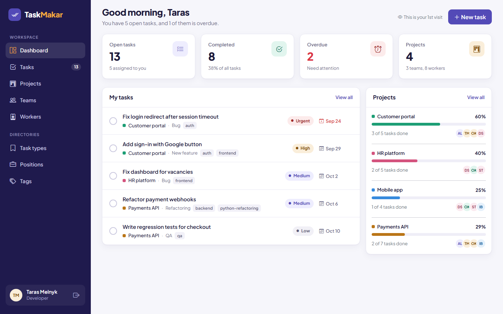
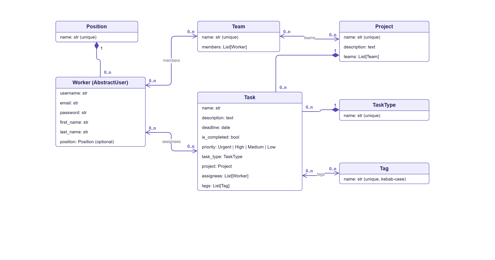
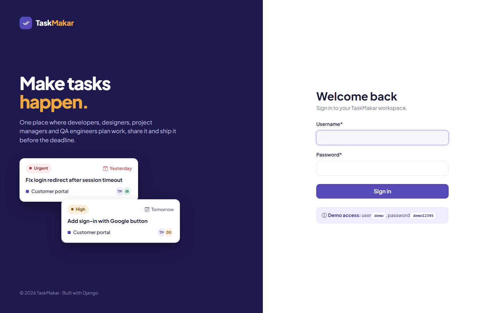
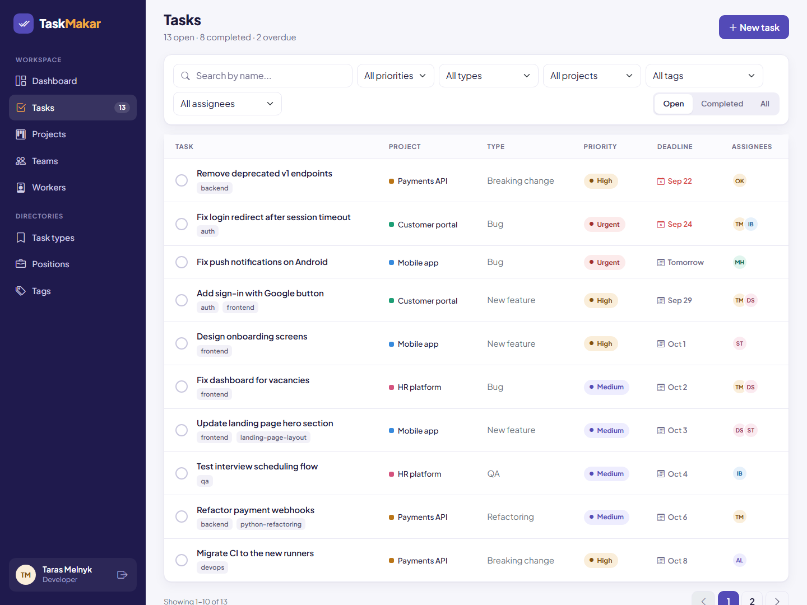
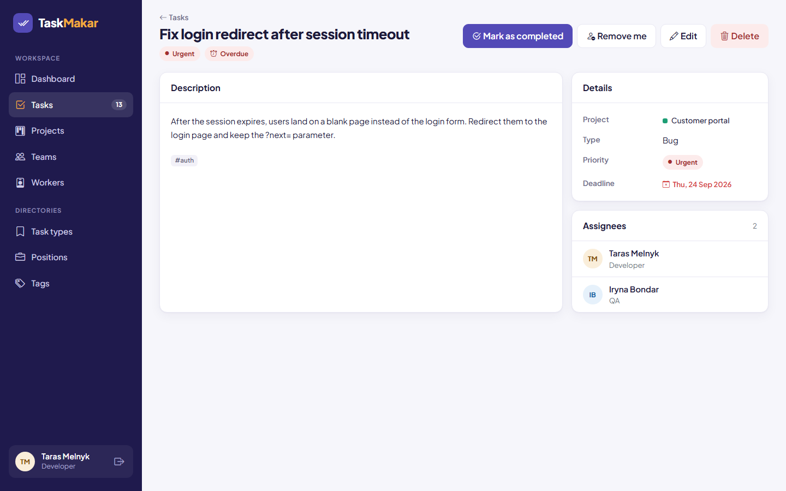
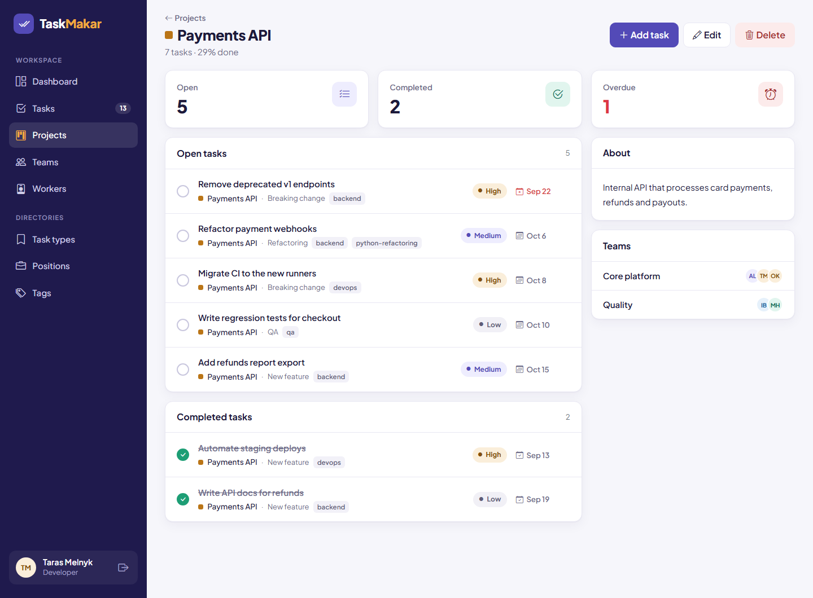
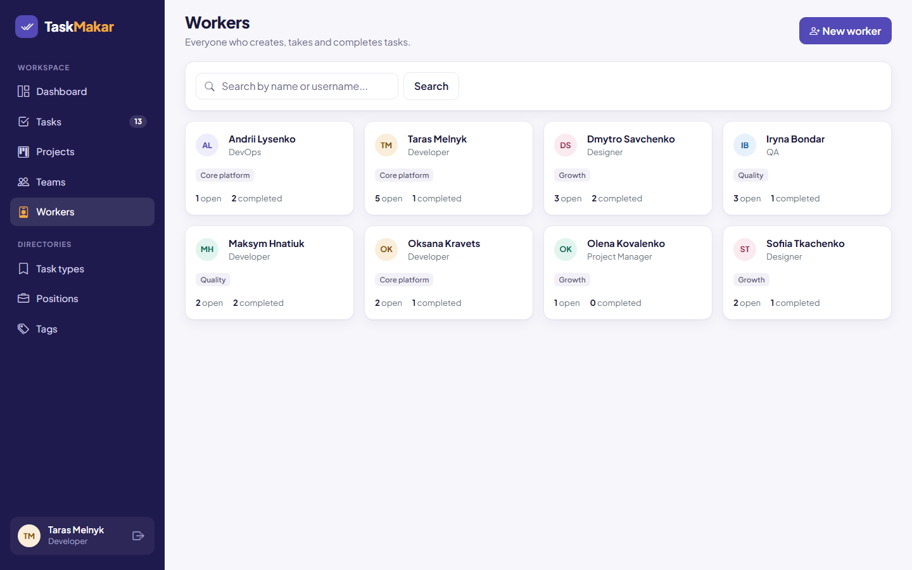
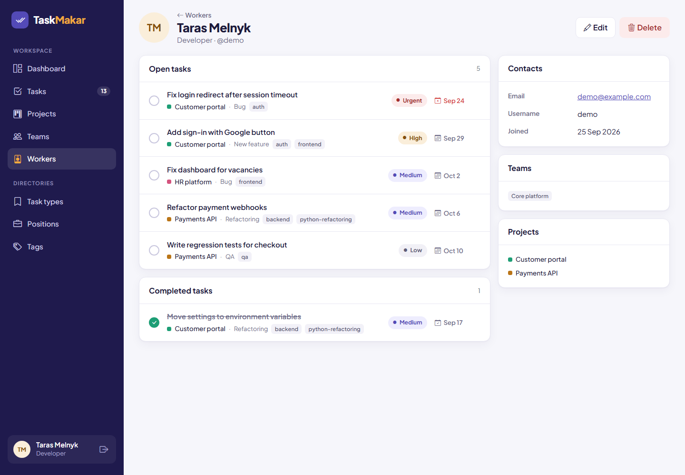
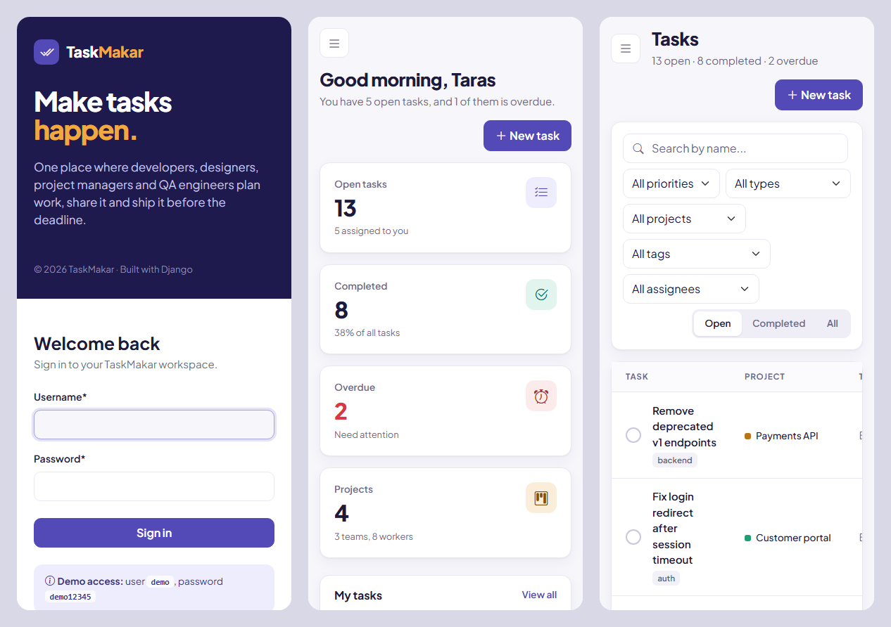

# TaskMakar

> Make tasks happen.

[](https://github.com/makar111111/task-makar/actions/workflows/ci.yml)


**TaskMakar** is a task manager for IT teams. Developers, designers,
project managers and QA engineers create tasks, assign them to each other
and mark them as done — ideally before the deadline. Teams work on
projects, and every project is a set of tasks.

**Live demo: [task-makar.onrender.com](https://task-makar.onrender.com)** —
sign in as `demo` with password `demo12345`.

> The demo runs on Render's free plan. After 15 minutes without visitors
> it falls asleep, so the first page may take about a minute to open.
> The demo data is created again on every start, so feel free to create,
> edit and delete anything.



## Features

- **Dashboard** — open, completed and overdue task counters, your open
  tasks, progress of every project and a visits counter.
- **Tasks** — search by name and filters by priority, type, project, tag,
  assignee and status. Pagination keeps the filters.
- **One-click actions** — "Assign me" / "Remove me" and "Mark as completed"
  / "Reopen". They are POST-only and redirect back only to local URLs.
- **Projects** — progress bars, overdue counters, open and completed tasks
  of the project and an "Add task" button that preselects the project.
- **Teams** — members and projects of a team, "Join team" / "Leave team".
- **Workers** — profiles with open and completed tasks listed separately,
  teams and projects of the worker.
- **Directories** — positions, task types and tags. A task type that is
  still used by tasks can't be deleted.
- **Validation** — a new deadline can't be in the past (an overdue task
  can still be edited), tags must be kebab-case: `landing-page-layout`.
- **Own design** — a TaskMakar theme on top of Bootstrap 5 that works on
  phones: the sidebar turns into a menu.
- **Demo data** — `python manage.py seed_demo_data` creates a team with
  projects and tasks. Deadlines are counted from today, so there are
  always overdue, upcoming and completed tasks.
- **Quality** — tests for models, forms, views, admin and the seed
  command, flake8 and GitHub Actions. Lists avoid N+1 queries with
  `select_related`, `prefetch_related` and annotations.

## Database structure



The diagram is made with draw.io: open
[`docs/db-schema.drawio`](docs/db-schema.drawio) at
[app.diagrams.net](https://app.diagrams.net) to edit it.

What happens on delete:

- a **position** is deleted → its workers stay without a position;
- a **project** is deleted → its tasks are deleted too (the confirmation
  page tells how many);
- a **task type** that is used by tasks can't be deleted;
- a **worker**, **team** or **tag** is deleted → only the links to them
  disappear.

## Screenshots

| Login | Tasks |
|---|---|
|  |  |
| **Task** | **Project** |
|  |  |
| **Workers** | **Worker profile** |
|  |  |

On phones:



Screenshots of every page are in [`docs/screenshots`](docs/screenshots).

## Tech stack

- Python 3.14, Django 5.2 LTS
- Bootstrap 5.3, Bootstrap Icons, Plus Jakarta Sans
- django-crispy-forms with crispy-bootstrap5
- django-debug-toolbar (development only)
- SQLite by default, PostgreSQL through `DATABASE_URL`
- Gunicorn and WhiteNoise in production, hosted on Render
- flake8 and GitHub Actions

## Deployment

The demo is deployed on [Render](https://render.com) from
[`render.yaml`](render.yaml) (a Render Blueprint):

- [`build.sh`](build.sh) installs the packages and collects static files,
  WhiteNoise serves them with compression and hashed names;
- [`start.sh`](start.sh) applies migrations, fills the database with demo
  data and starts Gunicorn;
- HTTPS-only settings are turned on with `DJANGO_SECURE_HTTPS=True`, the
  secret key is generated by Render.

The free plan has no persistent disk, so the SQLite database is created
again on every start. To keep data between restarts, set `DATABASE_URL`
to a PostgreSQL database.

## Getting started

```bash
git clone https://github.com/makar111111/task-makar.git
cd task-makar
python -m venv .venv
```

Activate the virtual environment: `.venv\Scripts\activate` on Windows,
`source .venv/bin/activate` on macOS and Linux. Then:

```bash
pip install -r requirements.txt
cp .env.sample .env
```

Put a secret key into `.env` (the file explains how to generate one) and
create the database:

```bash
python manage.py migrate
python manage.py seed_demo_data
python manage.py runserver
```

Open http://127.0.0.1:8000 and sign in as `demo` with password
`demo12345`. To use the admin site, create a superuser with
`python manage.py createsuperuser`.

## Tests and linting

```bash
python manage.py test
flake8
```

## Project structure

```
config/          settings and root URLs
task_manager/    models, views, forms, template tags, tests, seed command
templates/       base layout, pages and reusable includes
static/          TaskMakar theme and favicon
docs/            database schema (draw.io) and screenshots
```

## Why "TaskMakar"?

In Scots, *makar* literally means "maker" — someone who creates and builds
things. So TaskMakar is the place where tasks get made — and done.

---

Built as a portfolio project of the Python course at
[Mate academy](https://mate.academy).
